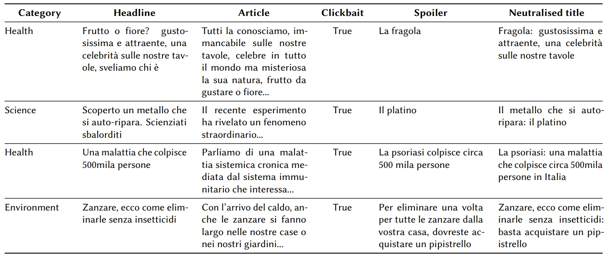
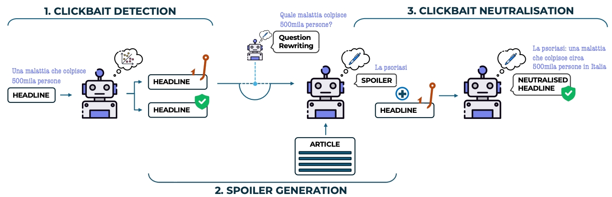

# ClickBaIT Dataset
Repository for the CLiC-it 2024 paper *"To Click it or not to Click it: An Italian Dataset for Neutralising Clickbait Headlines"*

# Dataset

The dataset is divided into two main sets.

* `Gold set` This set has been manually annotated by two experts.
* `Silver set` This set has been automatically annotated by a Llama3 model fine-tuned in the manual annotations.

## Dataset Structure

Both the `gold` and `silver` datasets comprise the following entries. 

```json
{
    "name": "name of the source",
    "macro_category": "scienza | salute | economia | ambiente",
    "date": "DateTime format" ,
    "article_url": "url of the article",
    "title": "headline of the article",
    "article": "text of the article",
    "title_clickBaitScore": "clickbait automatic score",
    "is_clickbait": "1 is clickbait else 0"
}
```
Entries from the `gold` dataset comprises two more manually annotated field, namely `spoiler` and `new_headline` (i.e., the neutralised version of the clickbait headline).

## Basic Dataset Statistics

The table below shows the basic statistics of the `ClickBaIT` dataset.

| Set   | Clickbait (\%) | Non-clickbait (\%) | Total |
|----------------|:-------------------------:|:-----------------------------:|:----------------:|
| Gold         | 698 (53%)              | 629 (47%)                  | 1,327          |
| Silver         | 1,563 (56%)            | 1,224 (44%)                | 2,787          |
| _Total_ | 2,261                   | 1,853                       | 4,114          |

## Open the Dataset

The dataset is stored in a [JSON lines](https://jsonlines.org/) format.
To read the data files, you can use the following code.

```python
import pandas as pd

df = pd.read_json("clickbait_dataset_gold.jsonl", orient="records", lines=True)
```

## Examples



# Experimental Pipeline

The `ClickBaIT` dataset was developed and evaluated across three distinct tasks: clickbait detection, spoiler generation, and clickbait headline neutralization. Below, we provide a visual representation of the experimental pipeline used in our study.



## Model Instructions

We have gathered all the instructions used throughout the work in the `prompts.py` file, which can be easily imported. The prompts can be used as follows:

```python
import prompts

headline_text = "your headline"
article_text = "your article"

formatted_instruction = prompts.SPOILER_GEN.format(headline = headline_text,
                                                   article = article_text)
print(formatted_instruction)
```

# Citation

If you use this data, please cite the following work.

```
TODO: ADD
```
